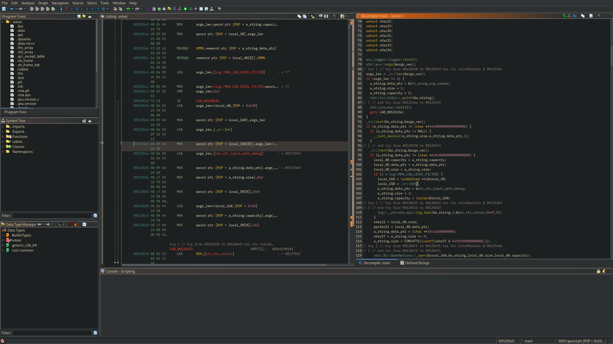

# ghidra gruvbox theme [insert logo I guess]
> The whole suite of [gruvbox](https://github.com/morhetz/gruvbox) and [gruvbox material](https://github.com/sainnhe/gruvbox-material) variants, ported to [ghidra](https://github.com/NationalSecurityAgency/ghidra), with some slight extensions to adapt it to Ghidra.



## How to install
In the project/main window's menu, select `Edit` &rarr; `Theme` &rarr; `Import…`.

You can then navigate to the folder in which you downloaded or cloned this repo and select the one you wish (refer to [screenshots](#screenshots) for examples!)...

... And you're good to go! If you still want to rice your ghidra a little bit more, the next section is for you!

## Further tuning
### Fonts
You can provide your own font for the decompiler, listing, and other places that use a monospaced font at line 15 of each theme, using the following format : 
```toml
font.monospaced = Font Name-Size
```
> _where `Size` is a single integer, in whichever unit ghidra uses_

### Comment styling
TODO

## Screenshots
TODO
