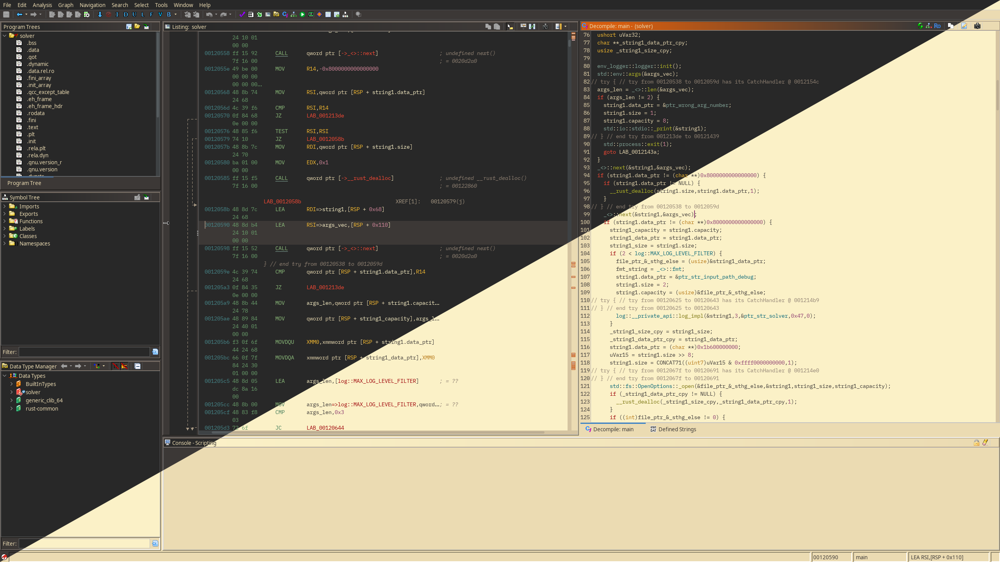
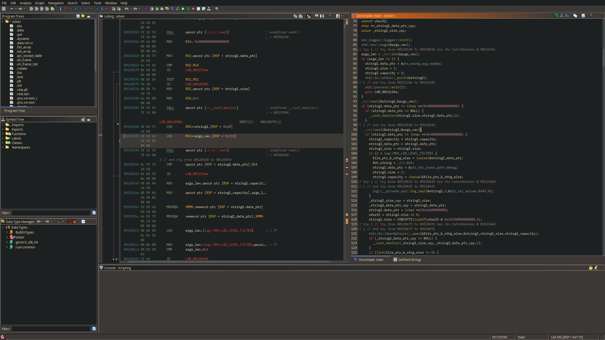
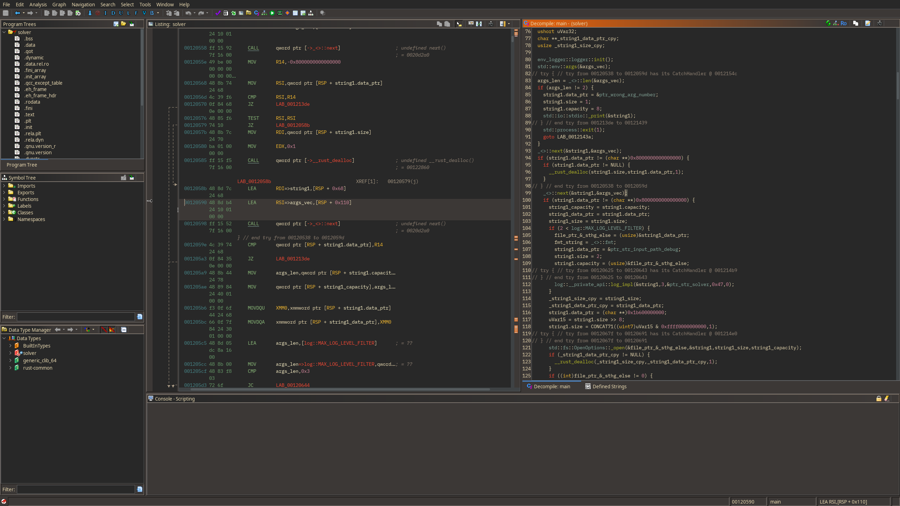
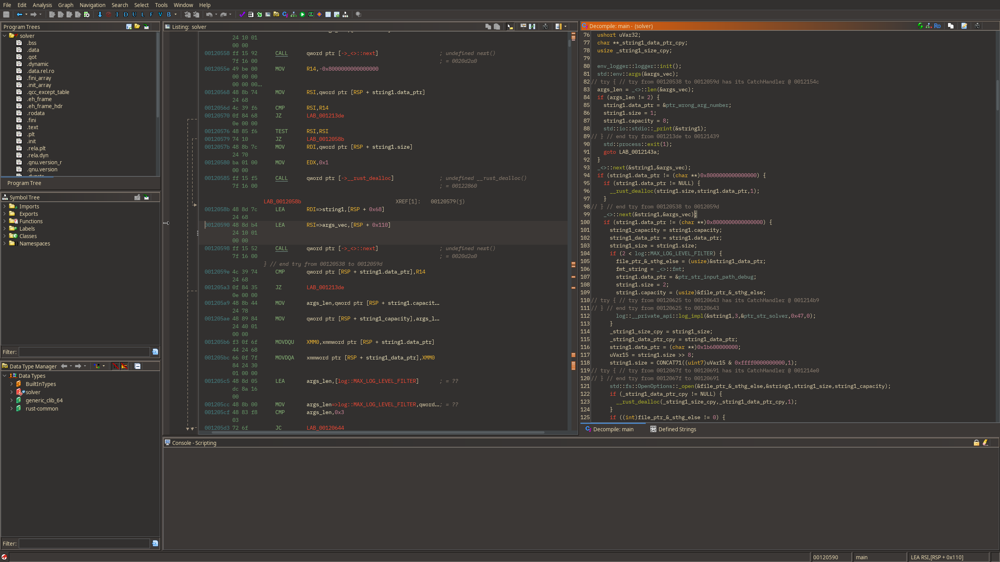
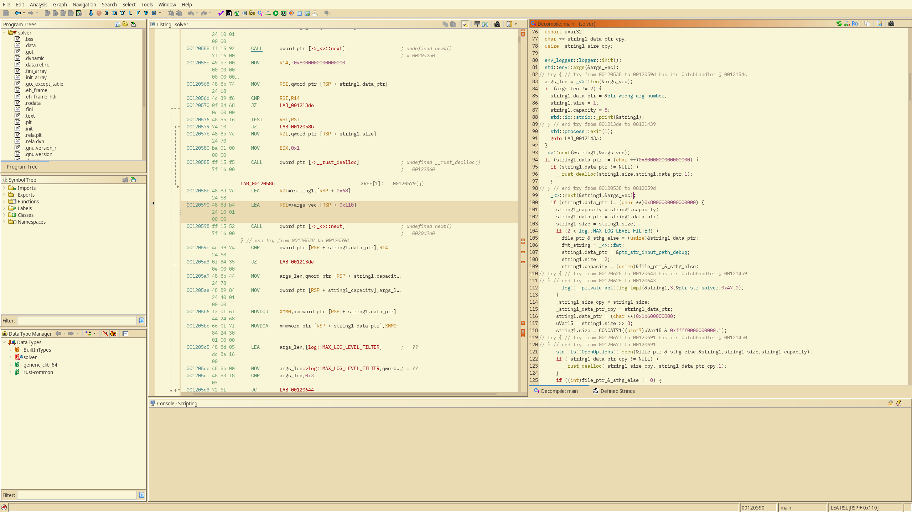
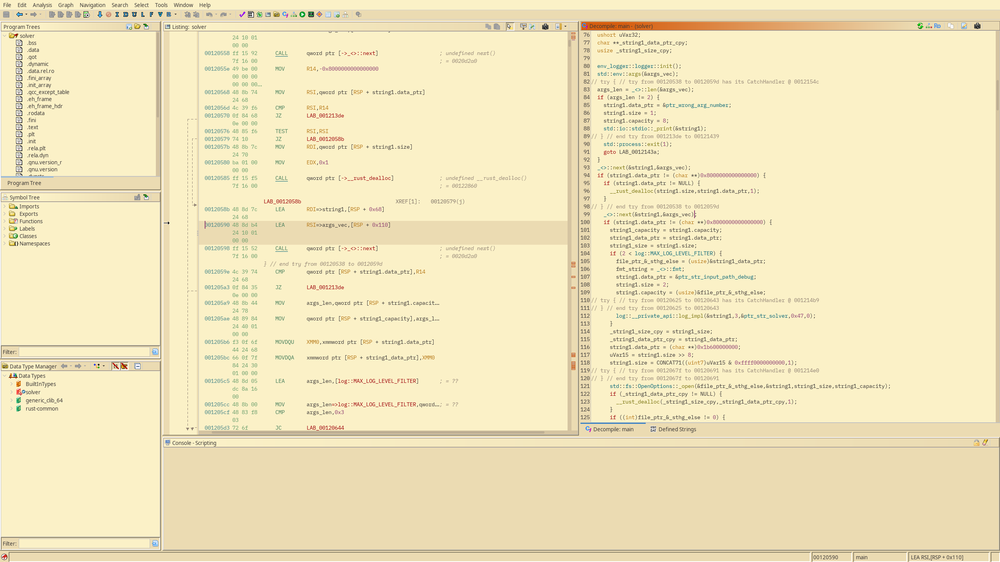
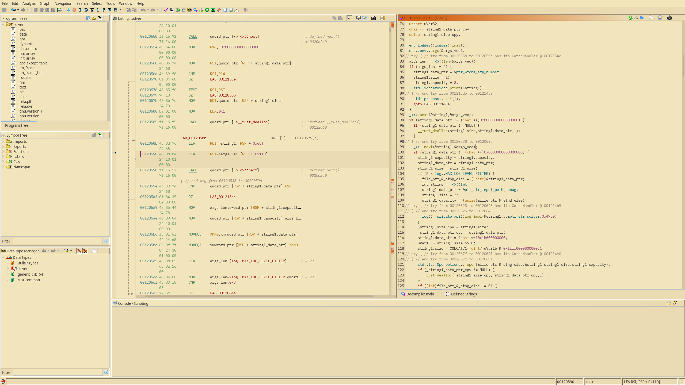

# ghidra-gruvbox-theme
> The whole suite of [gruvbox](https://github.com/morhetz/gruvbox) variants, ported to [ghidra](https://github.com/NationalSecurityAgency/ghidra)!



## How to install
In the project/main window's menu, select `Edit` &rarr; `Theme` &rarr; `Import…`.

You can then navigate to the folder in which you downloaded or cloned this repo and select the one you wish (refer to [screenshots](#screenshots) for examples!)...

... And you're good to go! If you still want to rice your ghidra a little bit more, the next section is for you!

## Further tuning
### Fonts
You can provide your own font for the decompiler, listing, and other places that use #a monospaced font at line 15 of each theme, uncommenting it and using the following format : 
```ini
font.monospaced = Font Name-STYLE-Size
```
> _where `Size` is a single integer (in whichever unit ghidra uses), and `STYLE`, one of `PLAIN`, `BOLD` or `ITALIC`_

:warning: Note that you will need to import the theme again into ghidra in order for the modifications to be taken into account.

### Comment font styling
You can as far as I know only style those for the listing view.  
To do so, in the CodeBrowser tool's menu, select `Edit` &rarr; `Tool options`, then select on the left list `Listing Display`

You can then, for each type of comment in the `Screen Element` listing, activate the `Custom` style settings and then `Bold` and/or `Italic` depending on your preferences.

## Screenshots
### Dark Hard

### Dark

### Dark Soft

### Light Hard

### Light

### Light Soft

